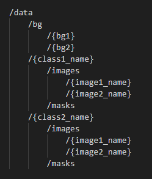

# synthetic_data_generator

Reference from:

GitHub repo:
https://github.com/alexppppp/synthetic-dataset-object-detection

Made a few changes such as:
1. Auto-masking        - Only needed to drop /data/{obj_name}/images folder that contains instances wanted to use for synthetic image dataset.
2. Classes.txt         - Classes.txt file being created and put into the /dataset file automatically, allows convenient upload to website like Roboflow (https://roboflow.com/).
3. Data with date time - Data now generated with date time and sequence number to enable combine of multiple dataset together quickly.
4. Out-of-bound adjust - Able to determine if wanted the instance being appear half/not-fully or definitely full image being place at create_composite()
5. Code organised      - using the file "/yolov5_data_generator.ipynb", it is easier to change parameters and control the generator.

Steps to use this generator:
1. Prepare and classify classes of instances into a single folder, and put them into "/data" folder in the format below. Note that for background(bg) images, insert the background into "/bg"

2. Open "/yolov5_data_generator.ipynb"
3. Modify parameters and classes on the first code block. Run all the code.
4. Receive a "/dataset/" folder that can be directly uploaded to Roboflow.